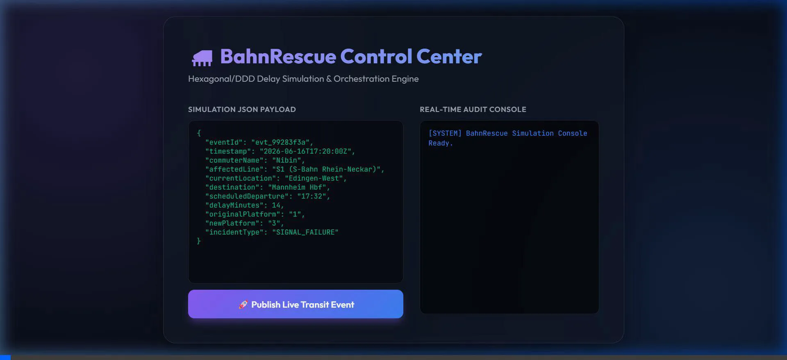
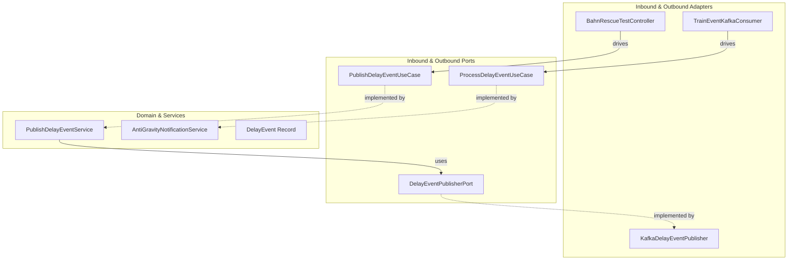

# 🚄 BahnRescue Engine

[](https://spring.io/projects/spring-boot)
[](https://jdk.java.net/)
[](https://kafka.apache.org/)
[](#architecture)

An event-driven transit platform core delay notification engine designed for high-performance commuter notifications. Built with **Spring Boot 3**, **Java 21 Virtual Threads**, and **Apache Kafka**, utilizing a strict **Hexagonal Architecture (Ports & Adapters)** design pattern.

---

### 📺 Live Demo Simulation

Below is the live simulation running from the control center webpage, dispatching events to Kafka, and processing them using virtual threads:



---

## 🚀 Key Architectural Highlights

*   **Virtual Threads (Project Loom):** High-throughput, resource-efficient asynchronous simulation using Java's virtual thread per-task executors (`Executors.newVirtualThreadPerTaskExecutor()`).
*   **Hexagonal Architecture:** Complete separation of business rules, application orchestrations, and infrastructure adapter details.
*   **Production-Ready Kafka Integration:** Out-of-the-box support for multi-listener configurations, serialization via Jackson JSON, Zookeeper service health checks, and automatic recovery.

---

## 📐 Architecture & Domain Boundaries

The application is structured into decoupled concentric rings:



*   **Domain (`com.bahnrescue.engine.domain`):** Pure Java records (e.g. `DelayEvent`) holding data models and core invariant logic.
*   **Ports (`com.bahnrescue.engine.port`):** Interface boundaries that define how the application interacts with inputs (Inbound Ports/Use Cases) and outputs (Outbound Ports).
*   **Services (`com.bahnrescue.engine.service`):** High-performance application services orchestrating domain interactions.
*   **Adapters (`com.bahnrescue.engine.adapter`):** Infrastructure-specific implementation modules (REST Controller, Kafka consumer/producer).

---

## 🛠️ Quickstart Guide

### 1. Spin up Apache Kafka & Zookeeper
Start the localized messaging backbone via Docker Compose:
```bash
docker compose up -d
```

### 2. Configure & Run Application
The application properties are pre-configured to bind to localhost on port `8080` and connect to the Docker Kafka broker:
```bash
# Compile and run the Spring Boot application
mvn spring-boot:run
```

### 3. Simulate a Transit Delay Event
Trigger a mock 14-minute signal failure delay event at the `Edingen-West` station:
```bash
curl -X POST http://localhost:8080/api/v1/test/event \
  -H "Content-Type: application/json" \
  -d '{"eventId":"evt_test123","timestamp":"2026-06-16T17:20:00Z","commuterName":"Nibin","affectedLine":"S1","currentLocation":"Edingen-West","destination":"Mannheim Hbf","scheduledDeparture":"17:32","delayMinutes":14,"originalPlatform":"1","newPlatform":"3","incidentType":"SIGNAL_FAILURE"}'
```

---

## 🔍 API & Messaging Contracts

### Rest Controller: POST `/api/v1/test/event`
*   **Payload (`DelayEvent`):**
    ```json
    {
      "eventId": "evt_test123",
      "timestamp": "2026-06-16T17:20:00Z",
      "commuterName": "Nibin",
      "affectedLine": "S1",
      "currentLocation": "Edingen-West",
      "destination": "Mannheim Hbf",
      "scheduledDeparture": "17:32",
      "delayMinutes": 14,
      "originalPlatform": "1",
      "newPlatform": "3",
      "incidentType": "SIGNAL_FAILURE"
    }
    ```
*   **Expected Response:** `202 Accepted`
    ```json
    {
      "status": "Accepted",
      "eventId": "evt_test123",
      "message": "Transit event with ID evt_test123 successfully published."
    }
    ```
